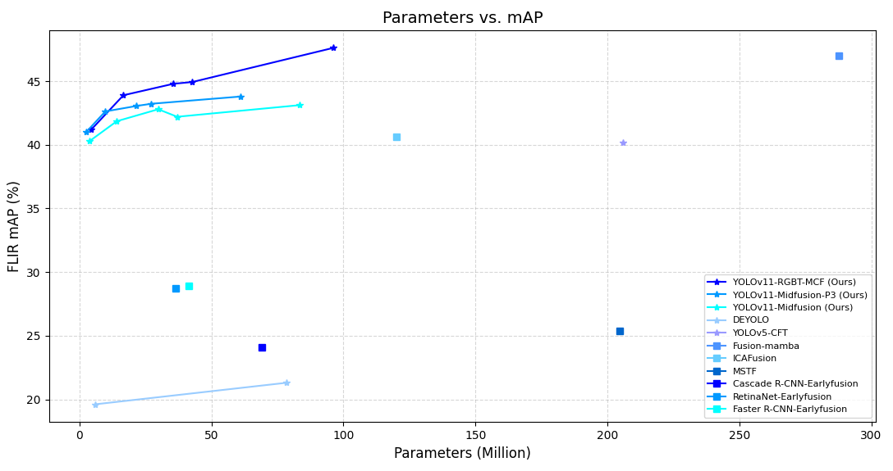
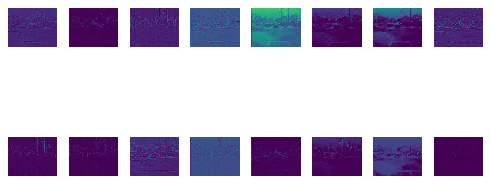
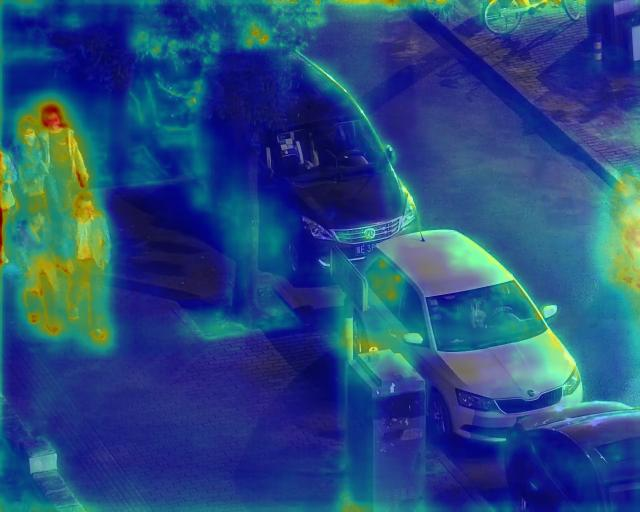

# [YOLOv11-RGBT: Towards a Comprehensive Single-Stage Multispectral Object Detection Framework](https://arxiv.org/abs/2506.14696)
[](https://arxiv.org/abs/2506.14696) 
[](https://1drv.ms/f/c/384d71bb2abb0199/Eh78MfQQYMNGi1owiw4yqywBHMVzltmccCuPRfkOriALgg?e=wDKPPx)
[](https://drive.google.com/drive/folders/14T2OaLAiMxlx8WJVyJ2x5DLI8RNI0R8m?usp=drive_link) 
[](https://pan.baidu.com/s/1Q6H98fiW_f7Kdq6-Ms6oUg?pwd=669j) 
[](https://pan.baidu.com/s/1xOUP6UTQMXwgErMASPLj2A?pwd=9rrf)



# YOLOv11-RGBT: 迈向全面的单阶段多光谱目标检测框架

# YOLOv11-RGBT 项目快速启动教程：多模态数据集配置（可见光与红外光）

## 项目简介
本项目旨在展示如何配置可见光（visible）和红外光（infrared）数据集，以适配基于 YOLOv11 的多模态目标检测任务。通过3种不同的配置方法（目录配置和 TXT 文件配置），您可以轻松地将可见光数据集与红外光数据集关联起来。

- 已添加YOLOv3-YOLOv12所有YOLO系列的yaml文件以及对应的RGBT  yaml文件
- 保留了YOLOv11 本身的训练模式，建议先学会搭建YOLOv11的环境和使用方式再来使用本项目（可以无缝使用YOLOv11的环境）
- 支持多光谱目标检测，多光谱关节点检测，多光谱实例分割任务
- 与YOLOv11相比，添加了2个参数， channels、use_simotm和 yaml模型文件里面的ch需要对应起来
- channels: 1 # (int) 模型通道数 具体介绍见下文
- use_simotm: SimOTMBBS # (str) 采用的训练模式，如 BGR , RGBT ，Gray 等等


## 更新日志:
- 2025-11-22  新增 1.TIFF图像支持(所有模式)  2. 16位任意通道数目的多光谱目标检测数据集
- 2025-10-14  模型权重和数据集One网盘链接: [one drive](https://1drv.ms/f/c/384d71bb2abb0199/Eh78MfQQYMNGi1owiw4yqywBHMVzltmccCuPRfkOriALgg?e=wDKPPx)
- 2025-09-17  添加了 pairs_rgb_ir 参数，可以自定义可见光和红外的命名，原理是将字符1替换为字符2，默认pairs_rgb_ir= ['visible','infrared']
- 2025-07-10  模型权重和数据集谷歌网盘链接: [google drive](https://drive.google.com/drive/folders/14T2OaLAiMxlx8WJVyJ2x5DLI8RNI0R8m?usp=drive_link)
- 2025-07-04  模型权重百度网盘链接 - 链接:https://pan.baidu.com/s/1Q6H98fiW_f7Kdq6-Ms6oUg ?pwd=669j  提取码:669j
- 2025-07-04  数据集百度网盘链接 - 链接:https://pan.baidu.com/s/1xOUP6UTQMXwgErMASPLj2A?pwd=9rrf  提取码:9rrf
- 2025-06-24  新增YOLOv13及YOLOv13-RGBT [paper](https://arxiv.org/abs/2506.17733) [code](https://github.com/iMoonLab/yolov13)
- 2025-06-22  加入了ICAFusion的NiNfusion和TransformerFusionBlock模块 (https://github.com/chanchanchan97/ICAFusion)
- 2025-06-19  添加了论文所对应的MCF训练代码及简单教程
- 2025-06-18  更正：本框架适合所有像素对齐的图像，不仅限于多光谱,包括深度图和SAR图像等
- 2025-06-18  新增了论文访问链接 [YOLOv11-RGBT](https://arxiv.org/abs/2506.14696)
- 2025-05-31  新增 任意通道数目的多光谱目标检测数据集
- 2025-04-18  添加了 CTF [CTF](https://github.com/DocF/multispectral-object-detection)
- 2025-02-14  第一次提交完整可训练可推理的代码


## 支持图像格式（use_simotm）：
1. uint8: 'Gray' 单通道8位灰度图像。   channels=1 ,  yaml   ch: 1 
2. uint16: 'Gray16bit' 单通道16位灰度图像。 channels=1 ,  yaml   ch: 1 
3. uint8: 'SimOTM' 'SimOTMBBS' 单通道8位灰度图像转换为三通道8位灰度图像。 channels=3 ,  yaml   ch: 3 
4. uint8: 'BGR' 三通道8位彩色图像。 channels=3 ,  yaml   ch: 3 
5. unit8: 'RGBT' 四通道8位多光谱图像。(包括前期融合，中期融合，后期融合，分数融合，权重共享模式) channels=4 ,  yaml   ch: 4 
6. unit8: 'RGBRGB6C' 六通道8位多光谱图像。(包括前期融合，中期融合，后期融合，分数融合，权重共享模式) channels=6 ,  yaml   ch: 6 
7. unit8: 'Multispectral'  任意通道8位多光谱图像 (包括前期融合，中期融合，后期融合，分数融合，权重共享模式) channels=n
8. unit16: 'Multispectral_16bit'  16-位 任意通道 多光谱图像 (包括前期融合，中期融合，后期融合，分数融合，权重共享模式) channels=n


## 数据集配置

### 1. 数据集结构
在 YOLOv8 中，可见光（visible）目录需要符合数据集配置原则。同时，可见光目录同级别下必须存在红外光（infrared）目录。此外，数据集需要分为 `train` 和 `val`（可选）子目录，分别用于训练和验证。

### 2. 配置方法
以下是4种推荐的配置方法(建议第一种。第一种对应网盘 新版本数据集，后面三种对应老版本的数据集配置方式)：
#### 注意事项  
- 确保可见光和红外光目录同级别。
- 如果采用txt文件构建yaml文件， TXT 文件路径需包含 `visible`，以便程序自动替换为 `infrared`。
- 如果遇到问题，请查看 `ultralytics/data/base.py` 中的 `load_image` 函数。

---
#### 方法 1：目录配置（FLIR数据集 配置示例，对应网盘 新版本数据集目录）
将可见光和红外光数据分别存储在同级别的目录中，每个模态下分为 `train` 和 `val` 子目录。目录结构如下：

```
dataset/                  # 实际数据集的地址，不用改名为dataset，放在任意位置都行
│   ├── visible/          # 存储 可见光图像 + 标签
│   │   ├── train/        # 训练
│   │   │    ├── image1.jpg 
│   │   │    ├── image1.txt   
│   │   │    ├── image2.jpg   
│   │   │    ├── image2.txt 
│   │   │    └── ...
│   │   │    
│   │   └── test/        # 验证/测试
│   │        ├── image5.jpg 
│   │        ├── image5.txt   
│   │        ├── image6.jpg   
│   │        ├── image6.txt 
│   │        └── ...
│   │       
│   └── infrared/         # 存储红外图像 + 标签
│       ├── train/        # 训练
│       │    ├── image1.jpg 
│       │    ├── image1.txt   
│       │    ├── image2.jpg   
│       │    ├── image2.txt 
│       │    └── ...
│       │    
│       └── test/         # 验证/测试
│            ├── image5.jpg 
│            ├── image5.txt   
│            ├── image6.jpg   
│            ├── image6.txt 
│            └── ...
labels/                 # 可选 这个目录可不用
    ├── train/          # 训练图像标签
    │   ├── image1.txt   
    │   └── image2.txt   
    └── test/         # 验证/测试标签
        ├── image5.txt 
        └── image6.txt 

```
```
# FLIR_aligned-rgbt.yaml  可见光+红外 数据集 yaml

path: E:/BaiduNetdiskDownload/RGBTO/FLIR3C  #更改为实际地址
train: visible/train
val: visible/test

## or
#train: E:/BaiduNetdiskDownload/RGBTO/FLIR3C/visible/train
#val: E:/BaiduNetdiskDownload/RGBTO/FLIR3C/visible/test


# number of classes
nc: 3

# class names
names: ["person", "car", "bicycle"]
```

```
# FLIR_aligned-rgbt.yaml  可见光 数据集 yaml

path: E:/BaiduNetdiskDownload/RGBTO/FLIR3C  #更改为实际地址
train: visible/train
val: visible/test

## or
#train: E:/BaiduNetdiskDownload/RGBTO/FLIR3C/visible/train
#val: E:/BaiduNetdiskDownload/RGBTO/FLIR3C/visible/test


# number of classes
nc: 3

# class names
names: ["person", "car", "bicycle"]

```   
```
# FLIR_aligned-inf.yaml  红外 数据集 yaml

path: E:/BaiduNetdiskDownload/RGBTO/FLIR3C  #更改为实际地址
train: infrared/train
val: infrared/test

## or
#train: E:/BaiduNetdiskDownload/RGBTO/FLIR3C/infrared/train
#val: E:/BaiduNetdiskDownload/RGBTO/FLIR3C/infrared/test


# number of classes
nc: 3

# class names
names: ["person", "car", "bicycle"]

```   

#### 方法 2：目录配置（KAIST 配置示例）
将可见光和红外光数据分别存储在同级别的目录中，每个模态下分为 `train` 和 `val` 子目录。目录结构如下：

```
dataset/  # 数据集的根目录
├── train/  # 存储训练集数据
│   ├── visible/  # 可见光图像相关数据
│   │   ├── images/  # 可见光图像文件
│   │   └── labels/  # 可见光图像的标签文件（如标注信息）
│   └── infrared/  # 红外图像相关数据
│       ├── images/  # 红外图像文件
│       └── labels/  # 红外图像的标签文件（如标注信息）
└── val/  # 存储验证集数据
    ├── visible/  # 可见光图像相关数据
    │   ├── images/  # 可见光图像文件
    │   └── labels/  # 可见光图像的标签文件（如标注信息）
    └── infrared/  # 红外图像相关数据
        ├── images/  # 红外图像文件
        └── labels/  # 红外图像的标签文件（如标注信息）

---------------------------------------------------------------------


# KAIST.yaml

# train and val data as 1) directory: path/images/
train: dataset/train/visible/images  # 7601 images
val:  dataset/val/visible/images # 2257 images

# number of classes
nc: 1

# class names
names: [ 'person', ]

-----------------------------------------------------------------------
```

- **train/visible**：存储训练集的可见光图像及其标签。
- **train/infrared**：存储训练集的红外光图像及其标签。
- **val/visible**：存储验证集的可见光图像及其标签。
- **val/infrared**：存储验证集的红外光图像及其标签。

程序会自动通过目录结构识别可见光和红外光数据。


#### 方法 3：目录配置（ 配置示例）
二级目录下，将可见光和红外光数据分别存储在同级别的目录中，每个模态下分为 `train` 和 `val` 子目录。目录结构如下：

```
dataset/
├── images/
│   ├── visible/
│   │   ├── train/  # 存储训练集的可见光图像
│   │   └── val/    # 存储验证集的可见光图像
│   └── infrared/
│       ├── train/  # 存储训练集的红外图像
│       └── val/    # 存储验证集的红外图像
└── labels/
    ├── visible/
    │   ├── train/  # 存储训练集的可见光图像标签
    │   └── val/    # 存储验证集的可见光图像标签
    └── infrared/
        ├── train/  # 存储训练集的红外图像标签
        └── val/    # 存储验证集的红外图像标签


---------------------------------------------------------------------

# KAIST.yaml

# train and val data as 1) directory: path/images/
train: dataset/images/visible/train  # 7601 images
val:   dataset/images/visible/val # 2257 images

# number of classes
nc: 1

# class names
names: [ 'person', ]

-----------------------------------------------------------------------

```


- **`images/`**：存储所有图像数据。
  - **`visible/`**：包含可见光图像。
    - **`train/`**：用于模型训练的可见光图像。
    - **`val/`**：用于模型验证的可见光图像。
  - **`infrared/`**：包含红外图像。
    - **`train/`**：用于模型训练的红外图像。
    - **`val/`**：用于模型验证的红外图像。

- **`labels/`**：存储所有图像的标签信息（例如标注文件、注释等）。
  - **`visible/`**：包含可见光图像的标签。
    - **`train/`**：用于训练集的可见光图像标签。
    - **`val/`**：用于验证集的可见光图像标签。
  - **`infrared/`**：包含红外图像的标签。
    - **`train/`**：用于训练集的红外图像标签。
    - **`val/`**：用于验证集的红外图像标签。

程序会自动通过目录结构识别可见光和红外光数据。


#### 方法 4：TXT 文件配置（VEDAI 配置示例）
使用 TXT 文件指定数据路径。TXT 文件内容应包含可见光图像路径，程序会自动将其替换为对应的红外光路径。TXT 文件需要分别指定训练集和验证集的路径（YOLOv5，YOLOv8，YOLOv11 默认配置方法）。

```
dataset/
├── images/
│   ├── visible/          # 存储 可见光图像
│   │   ├── image1.jpg  
│   │   └── image2.jpg 
│   │   └── ...
│   └── infrared/         # 存储红外图像
│       ├── image1.jpg   
│       └── image2.jpg  
│       └── ... 
└── labels/
    ├── visible/          # 存储可见光图像标签
    │   ├── image1.txt   
    │   └── image2.txt   
    └── infrared/         # 存储红外图像标签
        ├── image1.txt 
        └── image2.txt 
        
---------------------------------------------------------------------

# VEDAI.yaml
# 建议采用绝对路径
 
train:  dataset/train.txt  # 16551 images
val:  dataset/val.txt # 4952 images

# number of classes
nc: 9

# class names
names: ['plane', 'boat', 'camping_car', 'car', 'pick-up', 'tractor', 'truck', 'van', 'others']

-----------------------------------------------------------------------        
        
```


**示例 TXT 文件内容：**
#### 建议采用绝对路径
**train.txt**
```
dataset/images/visible/image1.jpg
dataset/images/visible/image2.jpg
dataset/images/visible/image3.jpg
```

**val.txt**
```
dataset/images/visible/image4.jpg
dataset/images/visible/image5.jpg
dataset/images/visible/image6.jpg
```

程序会将路径中的 `visible` 替换为 `infrared`，从而找到对应的红外光图像。

### 3. 原理说明
在 `ultralytics/data/base.py` 中的 `load_image` 函数中，有一处代码会将可见光路径中的 `visible` 替换为 `infrared`。因此，只要确保可见光目录同级别下存在红外光目录，程序即可正确加载对应的红外光数据。

---

## 快速启动指南

### 1. 克隆项目
```bash
git clone https://github.com/wandahangFY/YOLOv11-RGBT.git
cd YOLOv11-RGBT
```

### 2. 数据集准备
根据上述三种方法之一，配置您的数据集目录或 TXT 文件。

### 3. 安装依赖
(建议直接采用本电脑上已经搭建好的YOLOv11或者YOLOv8环境，不必重新下载，或者按照下列方法安装)
```bash
# 第一步：创建虚拟环境
conda create -n pt121_py38 python=3.8
conda activate pt121_py38

# 第二步：安装 pytorch 
conda install pytorch==1.12.1 torchvision==0.13.1 torchaudio==0.12.1 cudatoolkit=11.3 -c pytorch

# 第三步：安装 其余依赖项 
pip install -r requirements.txt

# 国内用下列命令安装：采用阿里镜像源,商业服务器租用时，清华源可能受限，无法下载，建议用阿里镜像源:
# pip install -r requirements.txt -i https://mirrors.aliyun.com/pypi/simple/

# 第四步：安装环境到系统 (如果需要终端命令启动，或者多卡训练)
pip install -e .

# https://pytorch.org/get-started/previous-versions/
## CUDA 10.2
#conda install pytorch==1.12.1 torchvision==0.13.1 torchaudio==0.12.1 cudatoolkit=10.2 -c pytorch
## CUDA 11.3
#conda install pytorch==1.12.1 torchvision==0.13.1 torchaudio==0.12.1 cudatoolkit=11.3 -c pytorch
## CUDA 11.6
#conda install pytorch==1.12.1 torchvision==0.13.1 torchaudio==0.12.1 cudatoolkit=11.6 -c pytorch -c conda-forge
## CPU Only
#conda install pytorch==1.12.1 torchvision==0.13.1 torchaudio==0.12.1 cpuonly -c pytorch

## CUDA 11.8
#conda install pytorch==2.2.0 torchvision==0.17.0 torchaudio==2.2.0 pytorch-cuda=11.8 -c pytorch -c nvidia
## CUDA 12.1
#conda install pytorch==2.2.0 torchvision==0.17.0 torchaudio==2.2.0 pytorch-cuda=12.1 -c pytorch -c nvidia
## CPU Only
#conda install pytorch==2.2.0 torchvision==0.17.0 torchaudio==2.2.0 cpuonly -c pytorch
```


### 4. 运行程序
```bash
python train.py --data your_dataset_config.yaml

```
#### 训练模式说明

- 以下是项目中包含的不同训练模式的 Python 脚本文件，每个文件针对特定的训练需求和数据类型，仅作为示例,实际上用一个train.py  合理修改参数即可。
- 此外，和YOLOv11 相比，仅添加了2个参数，
```bash
channels: 1 # (int) channels of model
use_simotm: SimOTMBBS # (str) Pretreatment method

```


4.1. **`train.py`**
   - 基础训练脚本。
   - 用于标准的训练流程，适用于一般的图像分类或检测任务。

2. **`train-rtdetr.py`**
   - 针对RTDETR（Real-Time Detection Transformer）的训练脚本。

3. **`train_Gray.py`**
   - 灰度图像训练脚本。
   - 专门用于处理灰度图像的数据集，适用于需要在灰度空间进行图像分析的任务。

4. **`train_RGBRGB.py`**
   - RGB-RGB图像对训练脚本。
   - 用于同时处理两组RGB图像的训练，例如可见光和红外图像的配对训练，适用于多模态图像分析。

5. **`train_RGBT.py`**
   - RGB-T（RGB-Thermal）图像对训练脚本。
   - 用于处理RGB图像和热成像（红外）图像的配对训练，适用于需要结合可见光和热成像信息的应用场景。

### 5. 测试
运行测试脚本以验证数据加载是否正确：
```bash
python val.py
```


### 6. 可视化
#### 6.1 特征图可视化
设置 detect.py 的 visualize=True:
```python
import warnings
warnings.filterwarnings('ignore')
from ultralytics import YOLO

if __name__ == '__main__':
    model = YOLO(r"runs/M3FD/M3FD_IF-yolo11n2/weights/best.pt") # select your model.pt path
    model.predict(source=r'G:\wan\data\RGBT\M3FD_Detection\images_coco\infrared\trainval',
                  imgsz=640,
                  project='runs/detect',
                  name='exp',
                  show=False,
                  save_frames=False,
                  use_simotm="RGB",
                  channels=3,
                  save=False,
                  # conf=0.2,
                  visualize=True # visualize model features maps
                )
```
```bash
python detect.py
```



#### 6.2 Gradcam: 热力图可视化
运行 heatmap_RGBT.py :
```bash
python heatmap_RGBT.py
```



---

## 注意事项 （再次强调）
- 确保可见光和红外光目录同级别，并且每个模态下有 `train` 和 `val` 子目录。
- TXT 文件路径需包含 `visible`，以便程序自动替换为 `infrared`。
- 如果遇到问题，请查看 `ultralytics/data/base.py` 中的 `load_image` 函数。
- detect时目录也需要可见光和红外光目录同级别
---
# 数据集下载链接

以下是转换好的VEIAI, LLVIP, KAIST, M3FD数据集百度网盘链接如下（需要更改yaml文件里面的地址，如果采用txt文件来配置yaml文件，需要把txt文件里面的地址替换为自己的地址：记事本打开，Ctrl+H）。（另外，如有使用上述数据集，请正确引用原论文，如有侵权，请原作者联系，立即删除。）

- VEIAI (Vehicle Detection in Aerial Imagery (VEDAI) : a benchmark (greyc.fr))
- LLVIP (bupt-ai-cz/LLVIP: LLVIP: A Visible-infrared Paired Dataset for Low-light Vision (github.com))
- KAIST
  - 原地址 （SoonminHwang/rgbt-ped-detection: KAIST Multispectral Pedestrian Detection Benchmark [CVPR '15] (github.com)）
  - KAIST数据集完整及清洗后下载 - kongen - 博客园 (cnblogs.com)
- M3FD（JinyuanLiu-CV/TarDAL: CVPR 2022 | Target-aware Dual Adversarial Learning and a Multi-scenario Multi-Modality Benchmark to Fuse Infrared and Visible for Object Detection. (github.com)）

百度网盘链接：
链接: https://pan.baidu.com/s/1xOUP6UTQMXwgErMASPLj2A 提取码: 9rrf

---
# 模型权重文件下载链接
- 如果使用了以下权重，请正确引用本项目所对应论文，YOLOv11项目或者论文(根据YOLOv11版权声明)以及数据集所对应的论文(如LLVIP版权声明)

链接:https://pan.baidu.com/s/1Q6H98fiW_f7Kdq6-Ms6oUg   提取码:669j


## 项目文件说明

| 名称                               | 作用说明                                           |
| -------------------------------- |------------------------------------------------|
| **目录**                           |                                                |
| `.github`                        | 存放GitHub相关的配置文件，用于GitHub Actions的CI/CD流程。      |
| `PaperImages`                    | 存储与论文相关的图片或图表。                                 |
| `docker`                         | 存放与Docker相关的配置和脚本，用于容器化项目。                     |
| `docs`                           | 项目文档存放处，如使用说明、API文档等。                          |
| `examples`                       | 示例代码或配置文件，帮助用户快速上手。                            |
| `tests`                          | 测试相关代码，用于验证项目功能。                               |
| `ultralytics`                    | 包含与Ultralytics相关的代码或配置，Ultralytics是YOLO系列模型的开发团队。 |
| **文件**                           |                                                |
| `.dockerignore`                  | 指定在构建Docker镜像时要忽略的文件或目录。                       |
| `.gitignore`                     | 定义Git版本控制中要忽略的文件或目录模式。                         |
| `CITATION.cff`                   | 项目引用信息，方便他人引用项目。                               |
| `CONTRIBUTING.md`                | 贡献指南，说明如何参与项目贡献。                               |
| `LICENSE`                        | 项目的许可证信息，说明使用和分发的法律条款。                         |
| `README.md`                      | 项目说明文件，包含项目介绍、使用方法等。                           |
| `README_Zh.md`                   | README的中文版本，方便中文用户阅读。                          |
| `YOLOv11-RGBT-2506.14696_v2.pdf` | 与项目相关的PDF文档，论文及详细说明。                           |
| `detect-1C.py`                   | 用于单通道的检测任务示例，实际上，用一个文件即可。                      |
| `detect-4C.py`                   | 用于四通道的检测任务。                                    |
| `detect-6C.py`                   | 用于六通道的检测任务。                                    |
| `detect-multispectral.py`        | 任意通道多光谱检测的脚本。                                      |
| `detect.py`                      | 通用的检测脚本。                                       |
| `export.py`                      | 导出模型相关功能。                                      |
| `get_FPS.py`                     | 测量模型的帧率（FPS）。                                  |
| `heatmap_RGBT.py`                | 生成热力图的脚本，可能用于可视化检测结果。                          |
| `mkdocs.yml`                     | MkDocs的配置文件，用于生成项目文档。                          |
| `pyproject.toml`                 | Python项目的构建配置文件。                               |
| `requirements.txt`               | 项目依赖的Python包及其版本。                              |
| `train-rt detr.py`               | RT-DETR模型的训练脚本。                                |
| `train.py`                       | 通用的训练脚本。                                       |
| `train_Gray.py`                  | 灰度图像的训练脚本。                                     |
| `train_MCF_demo.py`              | MCF策略的训练演示脚本。                                  |
| `train_RGBRGB.py`                | RGB+红外6通道 图像的训练脚本。                             |
| `train_RGBT.py`                  | RGBT(4通道)图像的训练脚本。                              |
| `train_RGBT_mine_print.py`       | 批量打印模型的参数量和计算量。                                |
| `train_multispectral.py`         | 任意通道多光谱数据的训练脚本。                                |
| `transform_COCO_to_RGBT.py`      | 将在COCO上预训练的网络权重转换为RGBT模型权重。                    |
| `transform_MCF.py`               | 与MCF策略转换相关的脚本。                                 |
| `transform_PGI.py`               | 与PGI策略转换相关的脚本。                                 |
| `val_PGI.py`                     | PGI策略的验证脚本。                                    |
| `val.py`                         | 模型验证脚本。                                        |


## 贡献
欢迎提交 PR 或 Issue，共同完善项目。   本项目为长期开源项目，后续也将继续免费更新，不用担心费用问题。

## 联系方式
- GitHub：[https://github.com/wandahangFY](https://github.com/wandahangFY)
- Email：wandahang@foxmail.com
- QQ: 1753205688
- QQ群:483264141 (永久免费)


---

希望这份教程能帮助您快速启动项目！
  
  


## 中文解读链接
- [修改YOLOv8为RGBT多通道和单通道灰度图像检测](https://zhuanlan.zhihu.com/p/716419187)
- [YOLOv11-RGBT 论文解读-中文](https://mp.weixin.qq.com/s?chksm=ff76a74133af08172388bb5127ea1023751c2d92f46eda8074906e8690a5c137bc44fe230e82&scene=23&qq_aio_chat_type=2&srcid=08070UvMK8UDI638RYDeMlZJ&mpshare=1&mid=2247531181&idx=1&sharer_shareinfo=bb382e2cb8ac7d0dd7e904b012eb0c2f&sharer_shareinfo_first=bb382e2cb8ac7d0dd7e904b012eb0c2f&sn=aae766f60de666da47ce13aed261434b&__biz=MzU5OTA2Mjk5Mw==#rd)

## 视频教程链接
- [YOLO-MIF 视频解读和二次创新方案]() [TODO: 文字版PPT详细教程]

## 二次创新点梳理和代码实现（TODO）
- [二次创新方案]() [PPT教程的最后一页提供了部分二次创新方案，TODO: 如有需要，会在后面编写并更新代码]


## 文章链接
[YOLOv11-RGBT https://arxiv.org/abs/2506.14696](https://arxiv.org/abs/2506.14696)

[YOLO-MIF: Improved YOLOv8 with Multi-Information fusion for object detection in Gray-Scale images]( https://www.sciencedirect.com/science/article/pii/S1474034624003574)

## 引用格式
D. Wan, R. Lu, Y. Fang, X. Lang, S. Shu, J. Chen, S. Shen, T. Xu, Z. Ye, YOLOv11-RGBT: Towards a Comprehensive Single-Stage Multispectral Object Detection Framework, (2025). https://doi.org/10.48550/arXiv.2506.14696.

@misc{wan2025yolov11rgbtcomprehensivesinglestagemultispectral,
      title={YOLOv11-RGBT: Towards a Comprehensive Single-Stage Multispectral Object Detection Framework}, 
      author={Dahang Wan and Rongsheng Lu and Yang Fang and Xianli Lang and Shuangbao Shu and Jingjing Chen and Siyuan Shen and Ting Xu and Zecong Ye},
      year={2025},
      eprint={2506.14696},
      archivePrefix={arXiv},
      primaryClass={cs.CV},
      url={https://arxiv.org/abs/2506.14696}, 
}


## 参考链接
- [整体框架使用代码：YOLOv8](https://github.com/ultralytics/ultralytics)
- [重参数化参考丁霄汉代码：DiverseBranchBlock](https://github.com/DingXiaoH/DiverseBranchBlock)
- [部分模块参考魔鬼面具 开源主页代码](https://github.com/z1069614715/objectdetection_script)
- [YOLOv7](https://github.com/WongKinYiu/yolov7)
- [Albumentations 数据增强库](https://github.com/albumentations-team/albumentations)
- [YOLO-AIR](https://github.com/iscyy/yoloair)
- [CTF](https://github.com/DocF/multispectral-object-detection)


## 结尾
感谢您对本项目的关注和支持。作者尽力提供最好的质量和服务，但仍然有很多需要改进之处。如果您发现任何问题或有任何建议，请告诉我。
另外，本项目目前由我个人维护，难免存在疏漏和错误。如果您发现了任何问题，欢迎提出建议和意见。

## 其他开源项目
其余开源项目陆续在整理发布，后续请查看作者主页进行下载
[主页](https://github.com/wandahangFY)

## 相关问题解答
1. README.md 文件添加 （已完成）  
2. 详细教程 （TODO）
3. 项目环境配置（整个项目是YOLOv8  2023-11-29当日版本，配置参考README-YOLOv8.md文件和requirements.txt）
4. 文件夹对应说明（与YOLOv8保持一致，未改变超参数）（TODO：详细说明 ）
5. 二次创新点梳理和代码实现（TODO）
6. 论文作图：
   - 原理图，网络结构图，流程图：PPT （根据个人选择，也可以使用Visio，亿图，AI等）
   - 实验对比：Orgin（matlab,python,R,Excel都可以）


## Star History

[](https://star-history.com/#wandahangFY/YOLOv11-RGBT&Date)